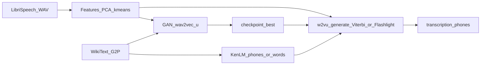

# REPORT_BRIEF_FOR_LLM — PROSIT 3 source pack

Use this document as structured context for report generation. Prefer copying **log excerpts** and **paths** verbatim; do not invent metrics.

---

## metadata

| Key | Value |
|-----|-------|
| Repository (local) | `/Users/kanyen/dev/ashesi/NLP/p3/wav2vec_unsupervised` |
| Upstream course repo | `https://github.com/Ashesi-Org/wav2vec_unsupervised` |
| `git remote origin` (as of brief) | `https://github.com/Ashesi-Org/wav2vec_unsupervised.git` |
| **TODO (human)** | Replace cover-page URL with **your personal fork** after you fork + push (see [fork_and_cover_checklist](#fork_and_cover_checklist)). |
| **TODO (human)** | Learning notes: handwritten PDF is a **separate** Canvas deliverable — status not tracked in git. |

---

## document_purpose

- Consolidates assignment constraints, implementation facts, metrics, gaps, and suggested outline.
- Intended for an LLM that will produce the **technical report** (3–4 pages + cover with repo link).
- Does **not** satisfy the “learning notes” deliverable (hand-written PDF).

---

## assignment_constraints

Sourced from **ICS554 — PROSIT 3: Leveraging GANs for Unsupervised Speech Recognition** (MSc Intelligent Computing Systems; course PDF).

### Scenario and problem (use in Introduction)

- **Setting:** You are a graduate researcher at **Amari Research Labs**; the company wants a **Wav2Vec-U** implementation (Baevski et al., 2021) where GAN code follows **separation of concerns**.
- **Required classes (must appear clearly in the report):**
  1. **Generator** — provides “fake” samples (speech-conditioned phoneme distributions).
  2. **RealData** — provides “real” samples (text-derived phoneme inputs for D).
  3. **Discriminator** — distinguishes real vs fake.
- **Starter repo:** [https://github.com/Ashesi-Org/wav2vec_unsupervised](https://github.com/Ashesi-Org/wav2vec_unsupervised).
- **NB — individual work:** The PDF states the task is **individual**; your report should not imply group authorship of the core solution.

### Handout environment vs this implementation (justify in Implementation)

The PDF says the scripts were modified to run on **“any debian machine with CPU”** and that you **need not bother with CUDA**. Your project was adapted further for **macOS (Apple Silicon) with optional MPS**, Homebrew, and KenLM/Flashlight build fixes — **stricter than** the handout’s Debian/CPU story. **State this explicitly** in the report so examiners see you understood the assignment *and* extended portability.

### Course learning outcomes (weave into Discussion / Conclusion where natural)

The PDF lists related outcomes; a strong report touches them without inventing African-language experiments you did not run:

| Learning outcome (paraphrased) | How your report can reflect it |
|--------------------------------|----------------------------------|
| Read/implement NLP papers → reproducible experiments | Cite Baevski et al. (2021); describe pipeline stages and what you reproduced vs shortened (updates, subset). |
| Communicate clearly (technical + non-technical) | Clear diagram, plain-language pipeline intro, metrics table. |
| Construct/train/**evaluate** self-supervised SR; **low-resource** (incl. African languages) | Emphasize **unpaired** data + Wav2Vec-U motivation; use **evaluation** section (valid PPL, WER with refs); optional **future work** on African languages / more data (honest — not claimed as done). |
| Novel/contextual ideas for Africa | **Future work** only: e.g. adapting pipeline to unwritten/low-resource languages — do not claim unless you did it. |

### Deliverables (all must be tracked outside or inside the report)

| Deliverable | Requirement |
|-------------|-------------|
| **Learning notes** | **Hand-written**, legible; keep **cloud backups** of scans while working; **one merged PDF** → Canvas (separate from the technical report). |
| **GitHub code** | Work in **your fork** of the provided repo (cover page = **your** repo URL). |
| **Technical report** | **3–4 pages** (body); **cover** includes **link to code repository**; explain **solution** and **thinking / justification**; submit PDF to Canvas. |

### Grading rubric — weights and sub-questions (checklist for the author)

**Weights:**

| Component | Weight |
|-----------|--------|
| Learning notes | 25% |
| Solution | 40% |
| Technical report | 15% |
| Viva | 20% |

**Sub-questions from PDF** — use the right column when preparing **each** deliverable:

| Criterion | PDF asks (verbatim themes) | Where this brief helps |
|-----------|---------------------------|------------------------|
| **Learning notes (25%)** | Evidence of **significant learning effort**? Notes **rich with information (entropy)**? Does **your solution make sense in view of your learning**? | Not in this file — your handwritten notes. **Align** report claims with what you documented learning. |
| **Solution (40%)** | Were you able to **solve the problem**? **How much progress**? **How well does your solution fare when evaluated**? | [metrics_log_extracts](#metrics_log_extracts), [evaluation_gaps](#evaluation_gaps_and_optional_next_steps), [solution_summary](#solution_summary) |
| **Technical report (15%)** | Does the report **describe your solution**? Does it show **thinking behind your solution** (**justification of choices**)? | [implementation_highlights](#implementation_highlights), [changes_from_upstream](#changes_from_upstream_linux_cuda_repo), [CHANGES.md](CHANGES.md), [before_submit_checklist](#before_submit_checklist_pdf_aligned) |
| **Viva (20%)** | Can you answer **technical (including coding) questions** on your solution? | [viva_prep](#viva_prep); trace any report figure or number to a **file path** or **log**. |

**Learning notes** and **viva** are separate from the 3–4 page technical report, but all four rubric areas should **tell one consistent story**.

Report must justify **choices** (implementation and experimental), not only describe code.

---

## repository_facts

- **Fairseq copy:** `wav2vec_unsupervised/fairseq_/`
- **Custom GAN model (assignment):** `fairseq_/examples/wav2vec/unsupervised/models/wav2vec_u.py` (also mirrored at project root `wav2vec_u.py` for `install_wav2vec_u()` copy step — see [CHANGES.md](CHANGES.md)).
- **Central config:** [config.sh](config.sh) — `DEVICE`, `TEST_RUN`, `GAN_*`, `TEXT_DATA_PERCENT`, etc.
- **Change log / report backbone:** [CHANGES.md](CHANGES.md) — macOS/MPS adaptation, pipeline fixes, model rounds (stock GAN, `JoinSegmenter`, `token_d`), dataset notes.
- **Pipeline progress checkpoint:** [data/checkpoints/librispeech/progress.checkpoint](data/checkpoints/librispeech/progress.checkpoint)
- **GAN training run (example):** `outputs/2026-04-10/14-31-59/` — `hydra_train.log`, `checkpoint_best.pt`
- **Decode run (examples):** older Viterbi-only log `outputs/2026-04-11/14-51-45/w2vu_generate.log` (`WER: None` without refs); current runs log under `results_path` in [eval_functions.sh](eval_functions.sh) (typically [data/transcription_phones/](data/transcription_phones/) / configured `GANS_OUTPUT_PHONES`).
- **KenLM generate config:** `fairseq_/examples/wav2vec/unsupervised/config/generate/kenlm.yaml` (`w2l_decoder: KENLM`, `unit_lm` for phone-LM mode).
- **Decoder implementation:** `fairseq_/examples/speech_recognition/w2l_decoder.py` (KenLM path + `<SIL>` trie token handling).
- **Decode sweep script:** [scripts/sweep_kenlm_decode.sh](scripts/sweep_kenlm_decode.sh).
- **Transcription outputs:** [data/transcription_phones/](data/transcription_phones/) — `test.txt`, `test_units.txt`; reference-backed **WER** when `test.phn` exists (see [metrics](#metrics_log_extracts)).

---

## solution_summary

**Problem (assignment):** Implement **Wav2Vec-U**-style unsupervised speech recognition with GAN code structured as separate **Generator**, **RealData**, and **Discriminator** classes (separation of concerns), using the provided Fairseq-based pipeline (adapted from Linux/CUDA to local environment).

**Idea (one paragraph):** Self-supervised speech features (wav2vec 2.0–style) are clustered into pseudo-units; a **Generator** maps continuous frames to fake phoneme distributions; **RealData** supplies “real” phoneme sequences from unpaired text (G2P + one-hot); the **Discriminator** distinguishes real vs fake. Training uses Wasserstein-style losses with gradient penalty (WGAN-GP). Decoding uses `w2vu_generate.py` with **Viterbi** (default) or optional **KenLM + Flashlight beam** (`./run_eval.sh <ckpt> kenlm`) to produce phone (or experimental word) transcriptions; reference **WER** uses `test.phn` when present.

**Class mapping (separation of concerns):**

| Class | Role |
|-------|------|
| `Generator` | Speech features → fake phoneme probability sequences |
| `RealData` | Text-derived phoneme indices → one-hot / probability vectors for D |
| `Discriminator` | Scores sequences as real vs fake (frame-level + token-level path in current implementation) |
| `JoinSegmenter` | Collapses consecutive same-argmax frames for token-level discriminator (see CHANGES.md) |
| `Wav2VecU` | Fairseq model: alternates G/D steps, losses, temperature, logging |

---

## implementation_highlights

**Relationship to [CHANGES.md](CHANGES.md):** The bullets below are a **thematic summary** for report drafting. They are **not** a full list of edits. The authoritative, file-by-file log of what you changed versus the original Linux/CUDA repo is **[CHANGES.md](CHANGES.md)** (sections **“Changes by File”** §§1–8 and **“Architecture Overview”** / model rounds). The inventory table in [changes_from_upstream](#changes_from_upstream_linux_cuda_repo) mirrors that structure in one place for LLM context.

- **Platform:** macOS; **MPS** when `DEVICE=mps` in `config.sh`; no CUDA on Apple Silicon.
- **Portability:** `INSTALL_ROOT` / `DIR_PATH` project-local; `sed -i` BSD/GNU; `brew` vs `apt`; KenLM CMake patches for Homebrew Boost/Eigen.
- **Data flow:** FLAC → `convert_audio.sh` → WAV; manifests; rVAD; silence removal; `prepare_audio.sh` (features, PCA, k-means); `prepare_text.sh` (G2P, KenLM ARPA/bin under `data/text/phones/`).
- **GAN model evolution:** Speed/profile alignment → **stock-aligned** `wav2vec_u.py` (single conv Generator, one-hot RealData, V-dim Discriminator, GELU); **`JoinSegmenter` + `token_d`** added to match upstream Fairseq behavior; **`code_ppl`** computed correctly.
- **`TEXT_DATA_PERCENT=65`** — more unpaired text for LM/real-data diversity (vs tiny subset); re-prep text if changed.
- **Training budget (current `config.sh`):** e.g. `GAN_MAX_UPDATE=5000`, `GAN_TRAIN_UTTERANCES=1892`, validate/save every 1000 updates — document as **deliberate** shorter run vs paper-scale 150k updates.
- **Evaluation / decoding:** [run_eval.sh](run_eval.sh) second argument selects **`viterbi`** (default, `w2vu_generate` + Viterbi) vs **`kenlm`** (Flashlight **LexiconDecoder** / **LexiconFreeDecoder** + KenLM `.bin`). Shared driver `_run_w2vu_generate` in [eval_functions.sh](eval_functions.sh). Phone references: `data/clustering/.../test.phn` + `targets=phn`. **`w2l_decoder.py`:** maps Hydra `lm_model` to the KenLM binary path where decoders expect `kenlm_model`; prefers **`<SIL>`** as silence index when present (phone dictionary compatibility). Dependencies: **`flashlight-text`**, **`flashlight-sequence`** (on macOS, OpenMP-free build e.g. `USE_OPENMP=0` if CMake fails). **`EVAL_LM_WEIGHT`** defaults to **0** because positive phone-LM weights often **collapse the beam** (empty hypotheses) for this checkpoint unless tuned in small steps; use [scripts/sweep_kenlm_decode.sh](scripts/sweep_kenlm_decode.sh) for a grid over `beam`, `lm_weight`, `word_score`.

---

## changes_from_upstream_linux_cuda_repo

The original [Ashesi-Org/wav2vec_unsupervised](https://github.com/Ashesi-Org/wav2vec_unsupervised) pipeline targets **Linux + NVIDIA CUDA**. The table below matches **[CHANGES.md](CHANGES.md) “Changes by File” (§§1–8)** and key **Architecture** subsections (GAN training wrapper, model rounds). Use **CHANGES.md** for code snippets, motivation, and troubleshooting (KenLM CMake, pyenv, fasttext, and so on).

### New files (not in upstream layout)

| Artifact | Purpose |
|----------|---------|
| [config.sh](config.sh) | Central `DEVICE`, `TEST_RUN`, audio/text limits, `GAN_*`, `TEXT_DATA_PERCENT`, etc. |
| [convert_audio.sh](convert_audio.sh) | FLAC → 16 kHz mono WAV; respects test-run and `AUDIO_DATA_PERCENT`. |
| [scripts/build_test_phn_from_librispeech.py](scripts/build_test_phn_from_librispeech.py) | Builds `test.phn` for reference **WER** (documented in CHANGES “Running the Pipeline”). |
| [scripts/sweep_kenlm_decode.sh](scripts/sweep_kenlm_decode.sh) | Optional decode hyperparameter grid (KenLM mode). |
| `fairseq_/.../config/generate/kenlm.yaml` | Hydra profile for Flashlight + KenLM beam decode. |

### Modified scripts — portability and pipeline (CHANGES §§3–7)

| File | What you changed (summary) |
|------|----------------------------|
| [setup_functions.sh](setup_functions.sh) | `INSTALL_ROOT` self-contained in repo; **brew** vs **apt**; skip CUDA on Darwin; PyTorch without `cu121` index on macOS; `nproc` → `sysctl` on macOS; **`install_wav2vec_u()`**; **KenLM** macOS patch + CMake flags; **pyenv** via Homebrew / fallbacks. |
| [run_setup.sh](run_setup.sh) | GPU detection without `lspci` on macOS; call `install_wav2vec_u`; timestamped setup logs. |
| [utils.sh](utils.sh) | `DIR_PATH` from script location; **`source config.sh`**; portable **`sed -i`**. |
| [wav2vec_functions.sh](wav2vec_functions.sh) | **`portable_sed_i`**, **`maybe_truncate_manifest`**, text subset for test runs; **prepare_text** path: no `grep -P`, fasttext build note, fairseq `--workers` cap, KenLM **`build_binary -s`**. |
| [run_wav2vec.sh](run_wav2vec.sh) | Source `config.sh`; **`convert_audio.sh`** before manifests when WAVs missing/insufficient; default corpus paths documented. |

### `wav2vec_u.py` — placement and model evolution (CHANGES §8 + Architecture rounds)

| Stage | What changed |
|-------|----------------|
| **Placement** | Root [wav2vec_u.py](wav2vec_u.py) copied into `fairseq_/examples/wav2vec/unsupervised/models/` by `install_wav2vec_u()`. |
| **Round 2** | **`generator_layers`** (speed vs WGAN-GP); **`code_ppl`** computed; Discriminator dims restored toward stock. |
| **Round 3** | **Stock Fairseq-style** Generator / one-hot **RealData** / **V-dim** Discriminator / **GELU**; config fields cleaned up; ~**1.09M** params (vocab 47). |
| **Round 4** | **`JoinSegmenter`** + **`token_d`** (token-level Wasserstein); **`TEXT_DATA_PERCENT=65`** for real-data diversity. |

### GAN training wrapper and logging (CHANGES Architecture — `gans_functions.sh` / `w2vu.yaml`)

| Topic | Change |
|-------|--------|
| **`prepare_gan_train_subset`** | Truncate `train.tsv` / `train.lengths`; **symlink** `train.npy` to avoid copying ~1.8 GB features when `GAN_TRAIN_UTTERANCES` &gt; 0. |
| **Hydra / Fairseq** | e.g. **`common.log_format: simple`**, **`log_interval: 5`**; `GAN_*` knobs forwarded from [config.sh](config.sh). |

### Evaluation extensions (same repo; align with CHANGES “Running the Pipeline” + KenLM subsection)

| File | Role |
|------|------|
| [eval_functions.sh](eval_functions.sh) | **`targets=phn`** + phone **`lm_model`** for Viterbi; **`transcription_gans_kenlm`** + **`_run_w2vu_generate`**. |
| [run_eval.sh](run_eval.sh) | **`viterbi`** vs **`kenlm`** CLI; env overrides documented in header. |
| `fairseq_/examples/speech_recognition/w2l_decoder.py` | KenLM path + **`<SIL>`** for phone lexica. |

For **decode metrics**, see [metrics_log_extracts](#metrics_log_extracts). For **dataset tables** (LibriSpeech, WikiText), CHANGES **“Dataset Information”** matches what the report needs.

---

## experimental_setup

| Aspect | Detail |
|--------|--------|
| Audio | LibriSpeech — `train-clean-100`, `dev-clean`, `test-clean` (see CHANGES.md table); unsupervised: **no** parallel audio–text for GAN |
| Text | WikiText-103 raw (unpaired) for phoneme LM / text side |
| Clustering dir (example) | `data/clustering/librispeech/precompute_pca512_cls128_mean_pooled/` |
| Device | `DEVICE` in [config.sh](config.sh) (e.g. `mps`) |
| Checkpoint for decode | e.g. `outputs/2026-04-10/14-31-59/checkpoint_best.pt` |

### Decode modes (for the report)

| Mode | Command | Decoder | Notes |
|------|---------|---------|-------|
| Viterbi (default) | `./run_eval.sh <ckpt>` | `config/generate/viterbi.yaml` | Optional `lm_model` for **LM PPL** on hypotheses; stable baseline. |
| KenLM + beam | `./run_eval.sh <ckpt> kenlm` | `config/generate/kenlm.yaml` | Requires Flashlight; **`EVAL_KENLM_MODE=phones`** (default) or **`words`** (lexicon + word LM). |

Environment overrides (KenLM mode): `EVAL_BEAM`, `EVAL_LM_WEIGHT` (default **0**), `EVAL_WORD_SCORE`, `EVAL_BEAM_THRESHOLD`, `EVAL_BEAM_SIZE_TOKEN`. See [CHANGES.md](CHANGES.md) KenLM subsection.

**Code touchpoints (for citations in the report):**

| File | Role |
|------|------|
| `fairseq_/examples/speech_recognition/w2l_decoder.py` | KenLM path wiring; `<SIL>` silence index for phone trie. |
| `fairseq_/examples/wav2vec/unsupervised/config/generate/kenlm.yaml` | `w2l_decoder: KENLM`, `unit_lm`, beam/LM overrides. |
| `eval_functions.sh` | `_run_w2vu_generate`, `transcription_gans_kenlm` (phones vs words). |
| `run_eval.sh` | `viterbi` vs `kenlm` CLI. |
| `scripts/sweep_kenlm_decode.sh` | Optional hyperparameter grid. |

---

## metrics_log_extracts

### Best validation (GAN / LM on generated phoneme text) — from training

**File:** `outputs/2026-04-10/14-31-59/hydra_train.log`

**Best line (lowest `weighted_lm_ppl` in logged valid intervals):** epoch 084, valid, **num_updates 1000**

```text
[2026-04-10 16:45:08,685][valid][INFO] - epoch 084 | valid on 'valid' subset | ... | weighted_lm_ppl 578.344 | lm_ppl 551.757 | ... | num_updates 1000
```

**Later checkpoints** (same log): valid at 2000–5000 updates show **higher** `weighted_lm_ppl`; log reports `best_weighted_lm_ppl 578.344`.

**Checkpoint files (same run directory):**

- `outputs/2026-04-10/14-31-59/checkpoint_best.pt`
- `outputs/2026-04-10/14-31-59/checkpoint_84_1000.pt` (aligned with best valid step)

### Decode / generate — reference phones + KenLM (setup)

**Reference labels:** [scripts/build_test_phn_from_librispeech.py](scripts/build_test_phn_from_librispeech.py) builds `test.phn` under the clustering dir from LibriSpeech `test-clean` transcripts + [data/text/lexicon_filtered.lst](data/text/lexicon_filtered.lst).

**Phone LM binary:** `data/text/phones/lm.phones.filtered.04.bin` (KenLM `build_binary -s` from ARPA if needed).

### KenLM + Flashlight beam — phones mode (default, stable `lm_weight=0`)

**Checkpoint:** `outputs/2026-04-10/14-31-59/checkpoint_best.pt`  
**Command:** `./run_eval.sh outputs/2026-04-10/14-31-59/checkpoint_best.pt kenlm` with defaults (`EVAL_KENLM_MODE=phones`, `EVAL_LM_WEIGHT=0`, `EVAL_BEAM=10`).

**Representative log lines (2026-04-15):**

```text
[2026-04-15 21:24:01,922][__main__][INFO] - WER: 99.07761194029851
[2026-04-15 21:24:01,922][__main__][INFO] - | Generate test with beam=10, lm_weight=0.0, word_score=1.0, sil_weight=0.0, blank_weight=0.0, WER: 99.07761194029851, LM_PPL: 7700.569362648582, num feats: 58232, length: 420, UER to viterbi: 0, score: 99.07761194029851
```

**Interpretation:**

- **Flashlight beam search is active** (not greedy CTC fallback). With **`lm_weight=0`**, the LM does not steer the beam; reported **`LM_PPL`** still reflects scoring of the chosen hypothesis.
- **`WER` ~99.08%** and **`length: 420`** (hypothesis token count) match the earlier **Viterbi**-style numbers for this checkpoint — **KenLM decoding did not materially improve WER** without LM contribution (expected: acoustic model limits dominate).
- **`UER to viterbi: 0`** is **(edit distance vs Viterbi hypothesis) × 100** in `w2vu_generate.py`; **0** means this decode’s hypothesis **matches the Viterbi path** on that comparison (expected when **`lm_weight=0`** and settings align).

### KenLM — words mode (`EVAL_KENLM_MODE=words`)

Word LM `data/text/kenlm.wrd.o40003.bin` + `data/text/lexicon_filtered.lst`. In testing, **`lm_weight=0`** yielded **WER ~99.93%**, **~520** hypothesis tokens (slightly different granularity vs phone units). **Higher `lm_weight`** with the word lexicon can trigger Flashlight **Trie** warnings (duplicate pronunciations) and **empty hypotheses**; treat word mode as experimental unless the lexicon is deduplicated and weights are swept carefully.

### Earlier / superseded log (do not quote as “current default”)

An intermediate run used **beam=5, lm_weight=2.0** on the phone LM and showed very high **LM_PPL** (~5.8e5) with the same **WER** (~99.08%) but is **not** the recommended setting — large `lm_weight` values often **collapse** the beam in phone mode.

### Historical baseline — no references

**File:** `outputs/2026-04-11/14-51-45/w2vu_generate.log` — **`WER: None`**, **`LM_PPL: inf`** when reference `targets` and/or LM binary were unavailable.

### Metrics table (copy-friendly)

| Metric | Value | Source / notes |
|--------|-------|----------------|
| Best valid `weighted_lm_ppl` | 578.344 | `hydra_train.log` @ 1000 updates |
| Best valid `lm_ppl` | 551.757 | same |
| Best checkpoint | `checkpoint_best.pt` (2026-04-10/14-31-59) | same directory |
| Decode **WER** (Viterbi + `test.phn`, phone LM scoring) | ~99.08% | Aligns with phone-target eval |
| Decode **WER** (KenLM beam, phones, `lm_weight=0`, beam=10) | **99.07761194029851** | 2026-04-15 `w2vu_generate` summary line |
| Decode **LM_PPL** (KenLM beam, phones, `lm_weight=0`) | **~7700.57** | same |
| Hypothesis **length** (tokens, KenLM phones) | **420** | same |
| Decode **WER** (KenLM words, `lm_weight=0`, experimental) | ~99.93% | Sweep / manual run; ~520 tokens |

---

## evaluation_gaps_and_optional_next_steps

Use as **limitations** and/or **future work** in the report.

1. **WER vs decoding:** Flashlight + KenLM are **installed and used** for **`kenlm`** mode; **WER remains ~99%** for this checkpoint — improvement needs **stronger AM** (longer training, full data) and/or **LM–AM scale tuning**, not only a different decoder executable.
2. **`lm_weight` tuning:** Default **`EVAL_LM_WEIGHT=0`** avoids empty beams. For LM-informed search, sweep **small** weights (e.g. 0.02–0.15) via [scripts/sweep_kenlm_decode.sh](scripts/sweep_kenlm_decode.sh); watch for **length collapsing** to ~0.
3. **Word lexicon:** Duplicate pronunciations can provoke Trie **“label number reached limit”** warnings and bad hypos at non-trivial `lm_weight`; deduplicate or filter lexicon if word LM is a priority.
4. **Long training:** Optional `GAN_MAX_UPDATE` toward paper-scale and `GAN_TRAIN_UTTERANCES=0` — time vs quality.
5. **Regenerate `test.phn`:** If `test.tsv` or `lexicon_filtered.lst` changes, re-run [scripts/build_test_phn_from_librispeech.py](scripts/build_test_phn_from_librispeech.py). Phone LM: `build_binary -s` on `.arpa` → `.bin` if needed.

---

## verbatim_core_requirement_three_classes

Exact class list from the assignment PDF (use to verify your report names them explicitly):

1. **Generator:** provides “fake” samples  
2. **RealData:** provides “real” samples  
3. **Discriminator:** discriminates between “real” and “fake” samples  

Map each to your code (see [solution_summary](#solution_summary)); **JoinSegmenter** / **Wav2VecU** are Fairseq helpers on top of that core split.

---

## report_outline_suggested

Target **3–4 pages** body + **cover** (cover is extra; body should stay within the page limit).

1. **Cover** — Title, name, course/program (**MSc Intelligent Computing Systems / ICS554**), date, **URL of your fork** (PDF requires repo link on cover).
2. **Introduction (about half a page)** — Supervised vs unsupervised ASR; **low-resource** motivation (PDF + Baevski et al., 2021); **Amari Labs** scenario in one sentence; **problem statement:** three-class GAN design + runnable pipeline; **individual** implementation.
3. **Method / architecture (about one page)** — End-to-end diagram ([optional_diagram](#optional_diagram_for_report)); frozen features → clustering; unpaired text → G2P + LM; **Generator / RealData / Discriminator** (and token-level path); **WGAN-GP** at high level.
4. **Implementation (about one page)** — **Debian/CPU handout vs your macOS/MPS port**; cite [CHANGES.md](CHANGES.md) themes: `config.sh`, `convert_audio.sh`, setup/training subset, **stock-aligned** `wav2vec_u.py` + **JoinSegmenter** / **token_d**; do **not** paste huge code — justify **choices**.
5. **Experiments and evaluation (about one page)** — Data (LibriSpeech / WikiText); training budget; **best `weighted_lm_ppl` / `lm_ppl`** and checkpoint; decoding (**Viterbi** vs **KenLM**); **WER** with `test.phn` — be honest about **~99%** and what it implies for **Solution (40%): how well evaluated**.
6. **Limitations, future work, and course outcomes** — Short run; full data; decode tuning; **optional** honest sentence on **African / low-resource** extensions as future work (PDF learning outcomes).
7. **Conclusion** — Checklist vs PDF: three core classes implemented, fork + repo link on cover, train + decode pipeline runs, metrics reported with interpretation.

---

## before_submit_checklist_pdf_aligned

| PDF requirement | Action |
|-----------------|--------|
| Technical report **3–4 pages** | Count **body** pages; cover/reference list often excluded from page count — confirm with instructor if unsure. |
| Cover has **repository link** | Must be **your fork**, not `Ashesi-Org/...` only. |
| **Learning notes** | Separate Canvas upload; **not** part of the 3–4 page technical report. |
| **Individual** work | No group authorship; collaboration policy per syllabus. |
| **Solution graded on evaluation** | Include numeric **validation** + **decode** metrics ([metrics table](#metrics_log_extracts)); explain limitations. |
| **Report graded on “thinking”** | Every major choice: *why* (platform, stock GAN alignment, subset, decoder mode). |

---

## citations

Use a consistent style (e.g. IEEE or APA) per course preference; the PDF names **Meta’s 2021 paper** as the core reference.

- Baevski, A., et al. (2021). *Unsupervised Speech Recognition* (Wav2Vec-U). [arXiv:2105.11084](https://arxiv.org/abs/2105.11084)
- Baevski, A., et al. (2020). *wav2vec 2.0: A Framework for Self-Supervised Learning of Speech Representations*. [arXiv:2006.11477](https://arxiv.org/abs/2006.11477)
- Goodfellow, I., et al. (2014). *Generative Adversarial Nets*. [arXiv:1406.2661](https://arxiv.org/abs/1406.2661)
- Gulrajani, I., et al. (2017). *Improved Training of Wasserstein GANs* (WGAN-GP). [arXiv:1704.00028](https://arxiv.org/abs/1704.00028)
- Panayotov, V., et al. (2015). *LibriSpeech: An ASR corpus based on public domain audio books.* ICASSP.
- Heafield, K. (2011). *KenLM: Faster and Smaller Language Model Queries.* WMT.
- LibriSpeech ([openslr.org/12](http://www.openslr.org/resources/12/)), WikiText-103 — as in [CHANGES.md](CHANGES.md).
- Course materials: ICS554 PROSIT 3 assignment PDF (deliverables and rubric).

---

## viva_prep

**PDF wording:** the viva checks whether you can answer **technical (including coding) questions** on your solution.

Short prompts to rehearse:

- Why **unpaired** audio and text?
- What does **`weighted_lm_ppl` / `lm_ppl`** validate during GAN training (language model on generated phoneme strings)?
- **WGAN-GP** role; why **gradient penalty**?
- **MPS vs CUDA** on Mac; any dataloader choices (`GAN_NUM_WORKERS`, etc.)?
- What does **`token_d` / `JoinSegmenter`** add vs frame-only discriminator?
- Walk through **`wav2vec_u.py`** class responsibilities.
- If **`WER`** is `None`, explain **exactly** what was missing (refs / `targets` / file layout).
- **`viterbi`** vs **`kenlm`** in `run_eval.sh`; why **`EVAL_LM_WEIGHT`** defaults to **0**; what **beam collapse** (empty hypotheses) implies.

---

## fork_and_cover_checklist

**TODO (human):** Canvas expects work on **your fork** and the **cover page repo link** should point to **your** GitHub repository.

Suggested steps (adapt usernames):

1. On GitHub: **Fork** `Ashesi-Org/wav2vec_unsupervised` to your account.
2. Add remote: `git remote add fork https://github.com/<you>/wav2vec_unsupervised.git`
3. Push: `git push fork main` (or your branch name).
4. Put **`https://github.com/<you>/wav2vec_unsupervised`** on the report cover.
5. Optional: set `origin` to your fork if you no longer track upstream as default.

Mark this checklist complete when the PDF cover shows the fork URL.

---

## optional_diagram_for_report

Mermaid (renders in many Markdown viewers):



---

## files_this_brief_does_not_replace

- [CHANGES.md](CHANGES.md) — primary narrative for implementation depth (includes KenLM eval subsection in “Running the Pipeline”).
- Raw logs under `outputs/` and decode `results_path` — authoritative for exact numbers.
- `data/results/librispeech/kenlm_sweep_*.tsv` — if you run [scripts/sweep_kenlm_decode.sh](scripts/sweep_kenlm_decode.sh).
- **Course PDF** (`Grad NLP Prosit 3.pdf`) — official deliverable wording, rubric, and learning outcomes; this brief was aligned to that document on **2026-04-15**.
